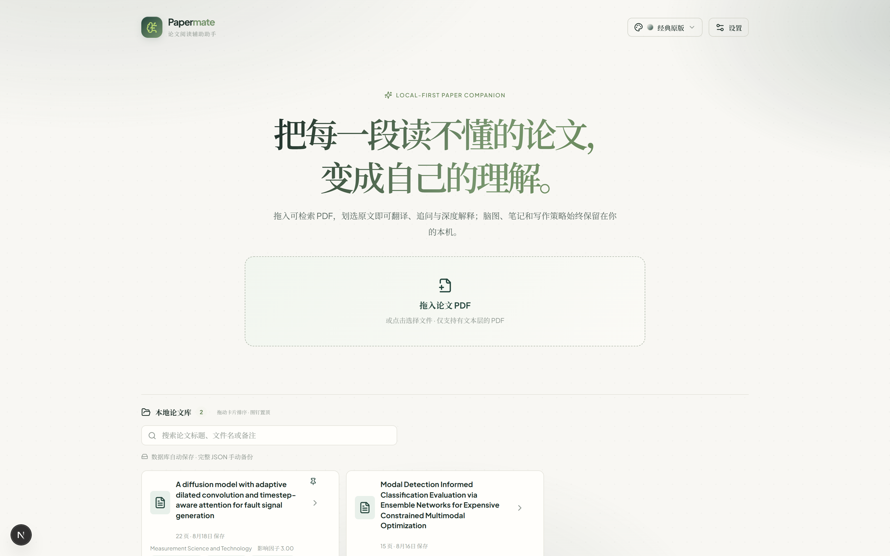
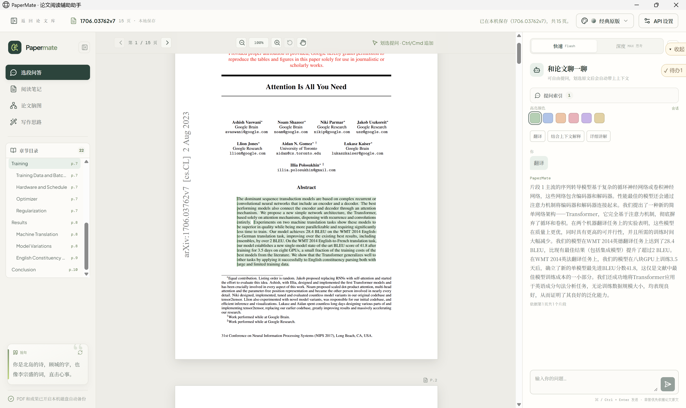
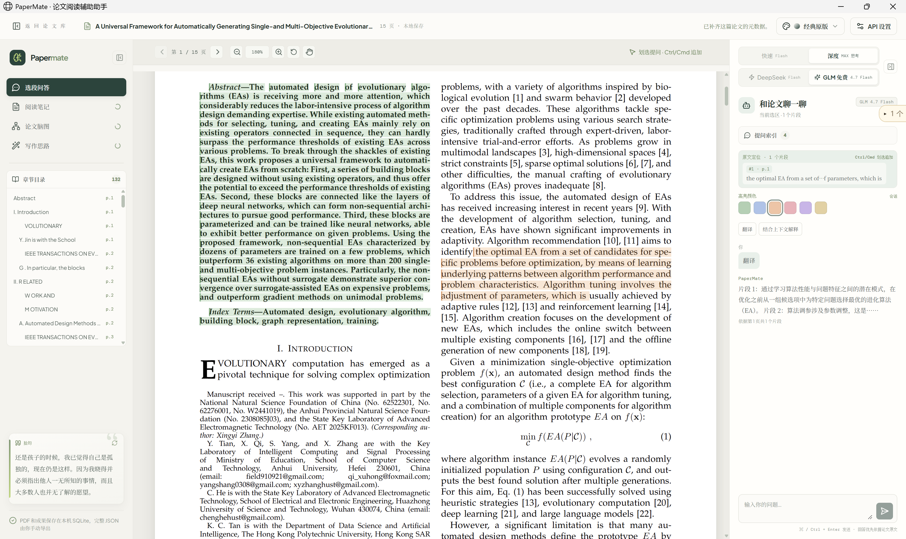
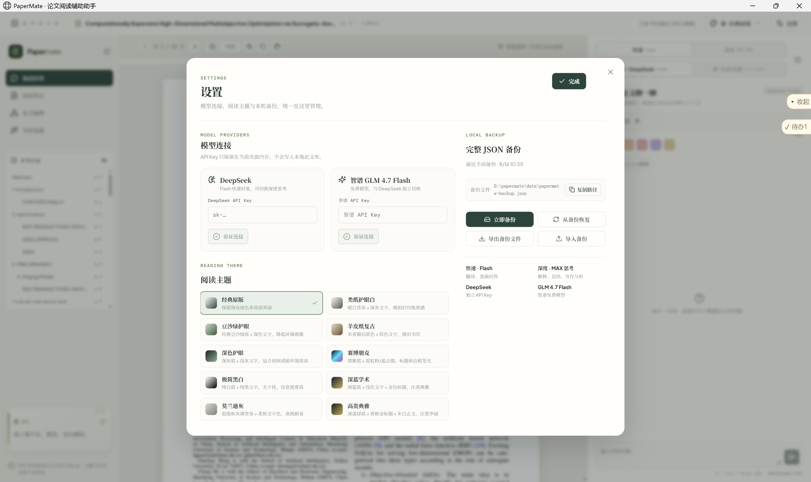
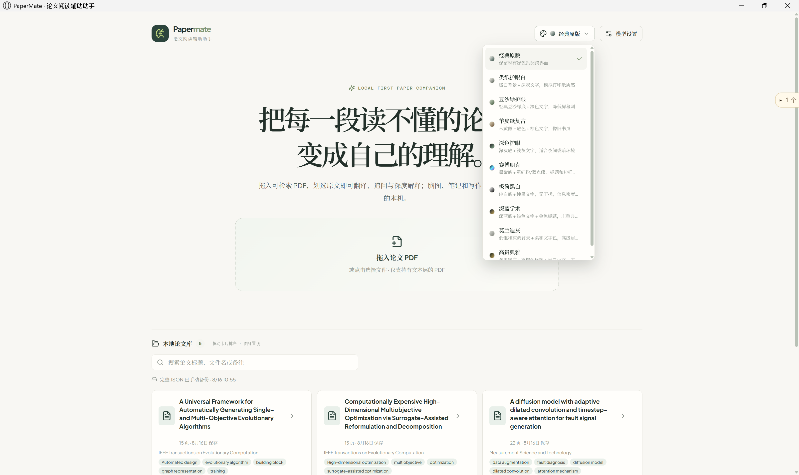
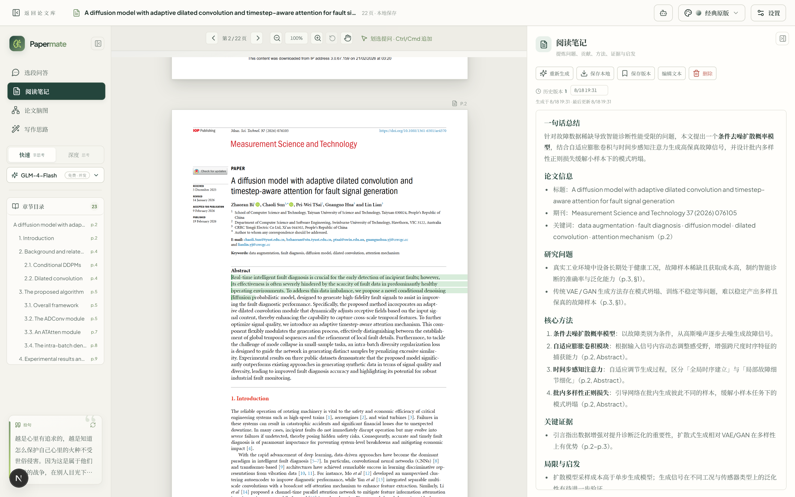
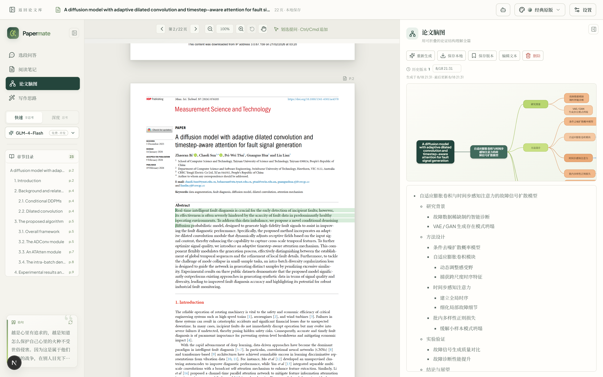
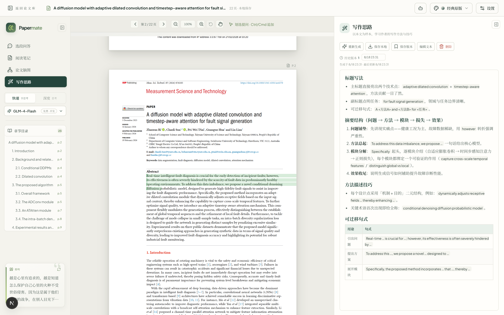

# PaperMate


PaperMate is a local-first, AI-assisted PDF reading tool for academic papers. Import a searchable PDF, read it in its original page layout, select passages directly on the page, and ask DeepSeek or the free Zhipu GLM model to translate, explain, answer questions, or generate reading notes, argument maps, and writing analysis.

Chinese users can read [README.zh-CN.md](README.zh-CN.md). Windows one-click installation is documented in [安装说明.md](安装说明.md) and [INSTALL.md](INSTALL.md). Feature and version history is tracked in [功能日志.md](功能日志.md) (Chinese) and [CHANGELOG.md](CHANGELOG.md) (English).

## Features

### Paper Library

- Import by dragging a searchable PDF into the app or clicking to choose a file; PDFs are deduplicated by source hash.
- Metadata is parsed automatically after import: title, keywords, journal, and impact factor, using the first-page layout, online Crossref / OpenAlex lookups when available, and local journal/keyword rules. Folded titles are merged and journal page headers are excluded.
- Search by title, filename, or note; drag cards to reorder; pin papers to the top; add a short note to each paper; delete a paper along with its saved data.
- The home screen shows page count, save time, journal, impact factor, keywords, and whether a complete JSON backup exists.

### Reading & Selection

- PDF.js renders each page in its original published layout, with a transparent text layer so selections stay aligned with the printed text.
- Zoom, pan, page navigation, chapter outline, and `Ctrl`/`Cmd` + wheel zoom keep the reading position stable.
- Select a paragraph and ask, or hold `Ctrl`/`Cmd` to append more fragments; up to 20 fragments from different pages can be combined.
- Native citation and figure links in the PDF are clickable: internal links jump to the target page and external links open the URL.
- Selections and conversations can be highlighted with different colors and deleted later.

### Reading Themes

- Ten built-in reading themes: classic, paper white, bean green, parchment, dark, cyberpunk, mono, academic blue, Morandi, and noble.
- Switch themes from the header or the settings panel; the choice is persisted locally.

### AI Assistant

- Chat about the selected passage or ask about the whole paper; the current selection is attached as context automatically.
- One-click prompts: translate the selection, or explain it with the full paper as context.
- Free-form questions can be sent with `Ctrl`/`Cmd` + Enter.
- Two answer modes: `Flash` for fast translation and routine questions, `MAX 思考` for deeper explanation, summarization, and writing analysis.
- Two providers: DeepSeek and the free Zhipu GLM 4.7 Flash model; each has its own API key and connection test.
- Multi-turn conversations are grouped by page/selection; a question index lets you jump back to earlier turns; individual conversations can be deleted.
- Translation, context explanation, concept explanation, free Q&A, reading notes, mind map, and writing analysis all use dedicated structured prompts.

### Generated Results

- **Reading notes**: Chinese Markdown notes with paper-type-specific sections (background/state of the art, research question, contributions, method, experiments, results, limitations, glossary, transferable insights). Key conclusions cite the original page, and formulas render with KaTeX.
- **Mind map**: a collapsible argument-structure map of the paper, previewed in the app and downloadable as an SVG image.
- **Writing analysis**: a writing-strategy breakdown covering the argument chain, section duties, paragraph progression, results/discussion split, language and evidence strength, and reusable frameworks.
- Results are editable, re-generable, downloadable as `.md` or `.svg`, and saved to the local paper library.

### Storage & Backup

- All local data lives in SQLite at `data/papermate.db`: PDFs, text blocks, highlights, conversations, notes, and generated artifacts.
- The database saves automatically; complete JSON backups are manual: backup now, restore from disk, export a backup file, and import one on another machine.
- The settings panel shows and copies the backup file path.
- `data/`, `.env*`, and `papermate-backup-*.json` are ignored by `.gitignore`, so your papers, API keys, and exported backups are never pushed to GitHub accidentally.

### Windows One-Click Install / Update / Uninstall

- Fresh install: choose an install location; the installer copies the project, installs dependencies, builds the production app, and creates shortcuts.
- Update: running `一键安装.bat` again detects the installed version and overwrites it in place while preserving the `data` folder.
- Uninstall: available from the Start menu, install directory, or Windows Settings; the `data` directory is preserved by default.

## Requirements

- Node.js 22.5 or newer (Node.js LTS recommended)
- npm
- A [DeepSeek API key](https://platform.deepseek.com/) or a free [Zhipu GLM API key](https://open.bigmodel.cn/) for model requests (either one)
- Windows 10/11 for the one-click installer; manual development works on any OS supported by Node.js and Next.js

## Quick Start

```bash
npm install
npm run dev
```

Open `http://localhost:3000`, click **设置 / Settings**, enter your DeepSeek or Zhipu GLM API key, and verify the connection.

## Windows One-Click Install

- **Fresh install (no existing version)** - Double-click `一键安装.bat`, choose an install location, and the installer copies the project, installs dependencies, builds the production app, and creates shortcuts.
- **Overwrite install (existing version detected)** - Double-click `一键安装.bat` again; once an existing install is detected in `%LOCALAPPDATA%\PaperMate\config.json`, it directly overwrites with the new version while preserving the `data` folder, without asking for a location again. No separate upgrade script is needed.
- Uninstall is available from the Start menu, the install directory, or Windows Settings. See [INSTALL.md](INSTALL.md) and [安装说明.md](安装说明.md) for details.

## Usage

1. Open **设置 / Settings**, choose DeepSeek or Zhipu GLM, enter the API key, and verify the connection.
2. Drag a searchable PDF into the app, or click to choose a file.
3. Read the original pages, zoom/pan as needed, and select a passage.
4. Hold `Ctrl`/`Cmd` to add more fragments, then ask a question, translate the selection, or toggle **结合上下文解释**.
5. In the left panel, open **阅读笔记**, **论文脑图**, or **写作思路** and generate the result; edit it or click **保存本地** to download it.
6. Use **Flash** for fast responses and **MAX 思考** for deeper reasoning.

## Interface Overview

| Screen | Description |
| --- | --- |
|  | Paper library: import PDFs, search papers, view metadata and notes, drag/pin papers, and check backup status. |
|  | Original-page reader with a transparent text layer, zoom/pan, chapter outline, and clickable citation/figure links. |
|  | Translate or explain the selected passage, then continue with multi-turn questions; answers reference source pages. |
|  | Unified settings panel: model providers and API key verification, reading themes, and complete JSON backup management. |
|  | Switch reading themes from the header; the choice is saved locally. |
|  | Generated reading notes with page-referenced evidence, glossary, and transferable insights. |
|  | Collapsible argument-structure mind map, exportable as SVG. |
|  | Writing-strategy analysis with argument chain, section duties, and reusable frameworks. |

## Saving Results

- Reading notes and writing analysis are editable Markdown. Click **保存本地** to download a `.md` file named after the paper and artifact, for example `{PaperTitle}-阅读笔记.md`.
- A mind map is downloaded as an `.svg` image using the same naming convention, for example `{PaperTitle}-论文脑图.svg`.
- Generated artifacts are also saved to the local SQLite database, so they survive browser cache clearing while the project folder is preserved.
- The settings panel provides full-library JSON backup: backup now, restore from disk, export a backup file, and import one on another machine.
- Sample outputs are included under `截图/`:
  - [Reading notes sample](截图/阅读笔记.md)
  - [Writing analysis sample](截图/写作思路.md)
  - [Mind map SVG sample](截图/论文脑图.svg)
- Backup JSON files created by the app (for example `papermate-backup-2026-08-16.json`) contain your library data and are excluded by `.gitignore`; keep them local and never commit them.

## Privacy

- PDFs, text blocks, selections, conversations, and generated content are stored in the local SQLite database at `data/papermate.db`. Complete JSON files are written to `data/papermate-backup.json` only when you use backup, export, or restore actions.
- The API key stays in page memory and is not written to SQLite, backup files, exports, or server logs.
- The original PDF is never uploaded. Only the text excerpts needed for the current request are sent to the model provider.
- The first release supports searchable PDFs only. OCR, DOCX, accounts, and cloud sync are not included.

## Limitations

- Only searchable PDFs with a text layer are supported; scanned PDFs and OCR are not supported.
- DOCX and other document formats are not supported.
- There is no account system or cloud sync; all data is stored locally.
- Model requests depend on a valid DeepSeek or Zhipu GLM API key and network access.

## Project Structure

```text
app/          Next.js App Router pages and API routes
components/   PDF reader and UI components
lib/          PDF parsing, storage, backup, mind maps, and tests
scripts/      Windows install/upgrade/start/stop/uninstall scripts
```

## Development Scripts

```bash
npm run dev    # start the development server
npm run lint   # run ESLint
npm run test   # run Vitest tests
npm run build  # create a production build
npm start      # run the production build
```

## Tech Stack

Next.js 15, React 19, TypeScript, PDF.js, Node.js SQLite (`node:sqlite`), IndexedDB (`idb`, kept only for one-time legacy migration), DeepSeek and Zhipu GLM Chat Completions with streaming, `react-markdown`, KaTeX, ESLint, and Vitest.

## Contributing

Please read [CONTRIBUTING.md](CONTRIBUTING.md) before opening issues or pull requests, and follow our [Code of Conduct](CODE_OF_CONDUCT.md). Security issues should be reported through [SECURITY.md](SECURITY.md).

## License

Released under the [MIT License](LICENSE).
