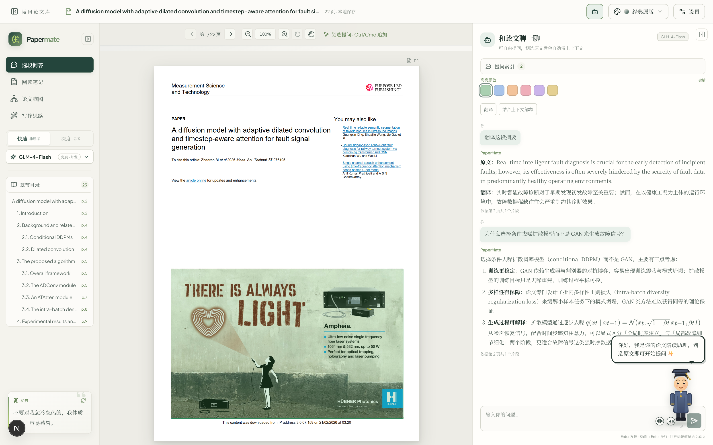
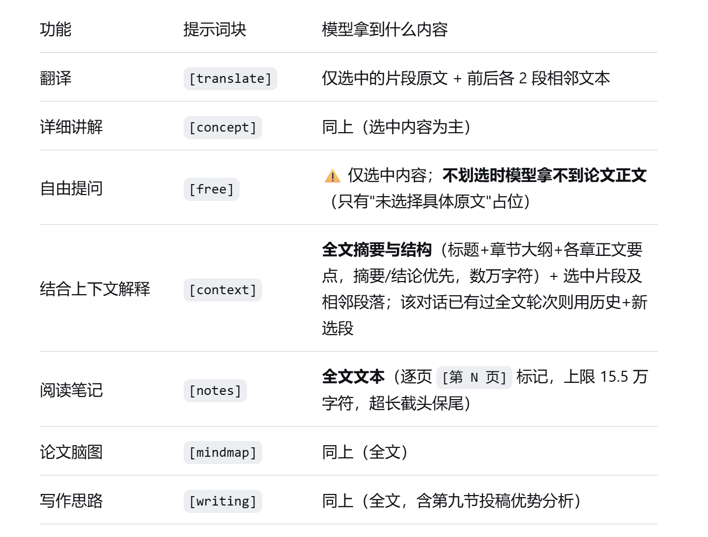

<div align="center">

**🌐 语言切换：简体中文** · [English](README.md)

</div>

# PaperMate


PaperMate 是一个本地优先、AI 辅助的论文阅读工具。导入带文本层的可检索 PDF 后，会按原版页面逐页展示，可以直接在透明文本层上划选段落进行多轮问答，也可以生成阅读笔记、论文脑图和写作思路分析。

Windows 一键安装详见 [安装说明.md](安装说明.md) 和 [INSTALL.md](INSTALL.md)。功能与版本历史详见 [功能日志.md](功能日志.md) 与 [CHANGELOG.md](CHANGELOG.md)。

## 功能

### 论文库

- 拖入带文本层的 PDF 或点击选择文件导入论文；按来源哈希去重。
- 导入后自动解析元数据：标题、关键词、期刊与影响因子，综合首页版面、在线 Crossref / OpenAlex 查询（网络可用时）与本地关键词、期刊规则；自动合并折行标题、排除期刊页眉。
- 支持按标题、文件名或备注搜索；拖动卡片排序；图钉置顶；按最近阅读排序（置顶优先）；为论文添加备注；删除论文及本地数据。
- 首页展示页数、保存时间、期刊、影响因子、关键词与完整 JSON 备份状态。

### 阅读与划选

- 使用 PDF.js 按论文原版排版渲染页面，透明文本层保证划选位置与原文一致。
- 支持缩放、平移、页码跳转与章节目录；`Ctrl`/`Cmd`+滚轮缩放保持阅读位置稳定；按住 `Alt` + 左键拖动可临时平移，左键双击可快捷选中单词。
- 划选一段原文即可提问；按住 `Ctrl`/`Cmd` 可追加片段，一次最多组合 20 个跨页片段。
- PDF 原生的引用与图表链接可点击：内部链接跳到论文对应页，外部链接打开对应 URL。
- 选区和会话支持多种高亮颜色，后续可以删除。

### 阅读主题

- 内置 20 套阅读主题：经典原版、类纸护眼白、豆沙绿护眼、羊皮纸复古、深色护眼、赛博朋克、极简黑白、深蓝学术、莫兰迪灰、高贵典雅，以及新增的机密绝密档案、电子墨水拟真等。
- 可从页面头部或设置面板一键切换，选择保存在本机。

### 拾句与提示词库

- 拾句：侧边栏展示拾句并支持刷新换句；内容保存在 `public/quotes.txt`（纯文本，每行一句，`#` 开头为注释），可直接增删改。
- 提示词：翻译、上下文解释、概念讲解、自由问答、阅读笔记、论文脑图、写作思路七个任务的提示词保存在 `public/prompts.txt`（每个任务以独占一行的 `[任务名]` 开始），直接编辑即可调整，保存后下次提问自动生效；删除某个任务块会回退到代码内置的默认提示词。

### AI 助手

- 可针对当前选段提问，也可自由提问整篇论文；提问时自动附带当前选区作为上下文。
- 一键指令：翻译选区、结合全文上下文解释；自由提问可用 `Ctrl`/`Cmd`+Enter 发送；`Enter` 直接发送、`Shift`+`Enter` 换行（中文输入法选词回车不会误发送）。
- **翻译与自动翻译**：`Alt`+`T` 翻译当前选区；`Alt`+`Shift`+`T` 切换「自动翻译」，开启后每次新划选自动翻译（每次都是新的单选段会话，不与上一次选区合并）。选单句或整段时，译文后附带简短语法讲解；多片段选区分段标注 `# 1`/`# 2`。
- **联网搜索**：三态开关——关闭、自动（仅当问题涉及外部事实、时效性、工具/产品/价格/版本时才检索）、强制（每次提问都检索）；检索结果以编号来源返回，正文中生成可点击的编号角标。搜索是与聊天模型解耦的独立服务，DeepSeek、GLM、Kimi 与自定义模型都能联网；只把提问原文发给搜索服务商，论文正文不离开本机；任何失败都降级为「不联网回答」，不阻断提问。服务商支持智谱（`search_std`/`search_pro`/`search_pro_sogou`/`search_pro_quark` 四档引擎）、博查、Tavily 与自定义接口；引用规则可在 `public/prompts.txt` 的 `[websearch]` 块中自定义。
- 两种回答模式：`Flash` 快速翻译与普通问答；`MAX 思考` 适合深度解释、总结和写作分析。
- 三提供方：DeepSeek、智谱 GLM 与 Kimi（kimi-k2.6），各有独立 API Key 与连接验证；GLM 提供双档模型 `glm-4-flash`（免费，官方支持高并发）与 `glm-4.7-flash`（互为备用）；DeepSeek 与 Kimi 支持并发对话，GLM 免费档全局单任务。
- 模型体系：内置 4 个模型（GLM-4-Flash、GLM-4.7-Flash、DeepSeek、Kimi），并可在设置中添加自定义模型（OpenAI 兼容 chat/completions，自定义地址、模型名与 API Key，自由增删改）；快速/深度按钮只切换思考开关。
- **AI 陪读小人**：五种人格（毒舌、温柔、哲思、鼓励、导师），随提问与回答场景回应，也可一键隐藏（隐藏后不再请求模型）；支持 40%–180% 尺寸调节并记住选择；人格提示词在 `public/buddy-personas.txt` 中可编辑，无 API Key 时使用本地兜底语料。
- 多轮会话按页码/选区分组；提问索引可快速跳回历史问答；可删除单条问答记录。
- 翻译、上下文解释、概念讲解、自由问答、阅读笔记、论文脑图、写作思路均使用结构化提示词。

### 生成成果

- **阅读笔记**：中文 Markdown，按论文类型组织（引言与研究现状、研究问题、核心贡献、方法、实验证据、结果与结论、局限、术语表、可迁移启发），关键结论标注页码，支持 KaTeX 公式渲染。
- **论文脑图**：可折叠的论文论证结构脑图，应用内预览，可导出为 SVG 图片。
- **写作思路**：写作策略分析，覆盖论证链、章节职责、段落推进、结果与讨论分工、语言与证据强度、可迁移写作框架。
- 成果可编辑、可重新生成，可下载为 `.md` 或 `.svg`，并自动保存到本地论文库。
- 每类成果保留历史版本：可查看、修改或删除之前生成的数据；生成失败不会覆盖原有数据。

### 存储与备份

- 所有本地数据保存在 SQLite 数据库 `data/papermate.db`：PDF、文本块、高亮、对话、笔记与生成成果。
- 数据库自动保存；完整 JSON 备份为手动操作：立即备份、从磁盘恢复、导出备份文件、在其他电脑导入。
- 设置面板展示并可复制备份文件路径。
- API Key 独立保存在本机 `data/apikey.txt`（明文，`data/` 不提交 Git），设置面板可快捷增删改查。
- 自定义模型配置（含 API Key）保存在本机 `data/models.json`，联网搜索配置保存在 `data/search.json`（均为明文，`data/` 不提交 Git），不写入备份与导出文件。
- `.gitignore` 已排除 `data/`、`.env*` 与 `papermate-backup-*.json`，本机论文、API Key 与导出的备份不会误推到 GitHub。

### Windows 一键安装/更新/卸载

- 全新安装：选择安装位置，自动复制项目、安装依赖、构建正式版本并创建快捷方式。
- 更新：再次双击 `一键安装.bat`，自动检测旧版本并增量更新（源码无变化时跳过复制与构建），保留 `data` 数据。
- 卸载：可从开始菜单、安装目录或 Windows 设置进入，默认保留 `data` 目录。

### 应用内自动更新

- 后台检测 GitHub **正式 Release**，仅在有新版本时弹窗，绝不阻塞打开论文；自动检测最多 6 小时一次，手动「检查更新」不受限频。
- 展示当前版本、新版本与更新说明，提供「立即更新」「稍后」；设置页可手动检测，并始终如实反馈结果（检测失败绝不写成「已是最新版」）。
- **不调用 api.github.com**：未认证的 API 每小时仅 60 次，共享出口 IP 极易耗尽（用户会看到「调用次数已用完」而完全无法更新）。检测改走 github.com `/releases/latest` 的普通跳转（与 API 同为「最新正式版」语义，排除草稿与预发布），更新说明从 `/releases.atom` 订阅源补齐，API 仅作最后兜底。
- 下载预构建的 Windows 包（自带 Node 运行时，用户机器无需安装依赖或构建），带进度条，并按随 Release 发布的校验文件做 SHA-256 校验。
- 安装前等待进行中的翻译、提问与保存结束，替换期间暂停新的模型请求。
- 独立助手负责停服务、备份整个旧安装、替换程序文件、对新版本做健康检查，失败时**自动回滚**并说明原因。助手经启动器从 updates 目录（**安装目录之外**）拉起——Windows 在进程仍占用安装目录时会拒绝替换其中的文件。
- 回写**安装阶段进度**（校验 → 解压 → 停服务 → 备份 → 保留数据 → 替换 → 启动 → 验证），界面显示独立于下载进度的安装进度条，回滚时同样有状态。
- 更新弹窗可以关闭而不中断更新：右下角保留「更新进行中 · 查看进度」入口，设置页按钮在更新期间变为「查看更新进度」。安装停滞或重启期间服务短暂连不上时会明确提示，而不是看起来卡死。
- 更新失败不会让应用卡死：助手非正常退出会报出退出码与诊断日志路径，所有失败路径都会释放更新锁，失败后仍可正常提问。
- 用户数据完整保留：论文、笔记、会话、API Key、模型配置与自定义提示词（`public/prompts.txt`、`public/quotes.txt`）；只替换程序文件。
- 源码目录（含 `.git`，或未登记为安装副本）只能检测与报告版本，绝不覆盖自身，本地改动的代码不会被清掉。

## 环境要求

- Node.js 22.5 或更高版本（建议 Node.js LTS）
- npm
- DeepSeek / 智谱 GLM（免费）/ Kimi API Key，用于模型请求，任选其一；如需联网搜索，另需搜索服务商 Key（默认复用智谱 Key）
- 一键安装脚本需要 Windows 10/11；手动开发可在任意支持 Node.js 与 Next.js 的系统上运行

## 快速开始

```bash
npm install
npm run dev
```

打开 `http://localhost:3000`，点击"设置"，输入 DeepSeek、智谱 GLM 或 Kimi 的 API Key 并验证连接。

## Windows 一键安装

- **全新安装（无旧版本）**：双击 `一键安装.bat`，选择安装位置，安装器自动复制项目、安装依赖、构建正式版本并创建快捷方式。
- **覆盖安装（有旧版本）**：再次双击 `一键安装.bat`，检测到 `%LOCALAPPDATA%\PaperMate\config.json` 中的已安装版本后，直接覆盖安装新版并保留 `data` 数据文件夹，无需重新选择安装位置（不再需要单独的升级脚本；源码无变化时自动跳过复制与构建，增量更新更快）。
- 卸载可以从开始菜单、安装目录或 Windows 设置进入。详细步骤见 [安装说明.md](安装说明.md) 和 [INSTALL.md](INSTALL.md)。

## 使用方式

1. 打开"设置"，选择 DeepSeek、智谱 GLM 或 Kimi，填写 API Key 并验证连接。
2. 把带文本层的 PDF 拖入应用，或点击选择文件。
3. 在原版页面上阅读，需要时缩放/平移，并划选一段原文。
4. 按住 `Ctrl`/`Cmd` 追加更多片段，然后提问、翻译选区，或开启"结合上下文解释"。
5. 在左侧面板打开"阅读笔记""论文脑图"或"写作思路"，生成结果后可编辑或点击"保存本地"下载。
6. 普通任务用"快速 Flash"，需要深入理解时切换到"深度 MAX 思考"。

## 界面一览

| 界面 | 说明 |
| --- | --- |
|  | 论文库：拖入 PDF、搜索、备注、置顶与拖动排序，查看本机磁盘备份状态。 |
|  | 原版页面阅读器：章节目录一键跳转、「拾句」随机金句，透明文本层支持精确划选。 |
|  | 当前选区与多轮问答，支持翻译、结合上下文解释、详细讲解等快捷指令，提问索引一键回跳。 |
|  | 设置：DeepSeek / GLM / Kimi 三家模型连接验证、自定义模型管理、联网搜索配置、阅读主题与本机备份管理。 |
|  | 生成阅读笔记，关键结论标注原文页码与证据。 |
|  | 生成可折叠的论文论证结构脑图。 |
|  | 生成写作策略分析，包含可迁移的段落与句式框架。 |
|  | 陪读小人：阅读陪伴、随机金句、人格切换与话痨调节。 |
|  | 提示词库：`public/prompts.txt` 直接编辑，保存后下次提问自动生效。 |

## 结果文件保存

- 阅读笔记和写作思路是可编辑的 Markdown 文本。点击"保存本地"会下载以论文标题和成果类型命名的 `.md` 文件，例如 `{论文标题}-阅读笔记.md`。
- 论文脑图按相同命名规则下载为 `.svg` 图片，例如 `{论文标题}-论文脑图.svg`。
- 每次生成的内容还会保存到本机 SQLite 数据库；只要项目目录还在，清空浏览器缓存后也能恢复。
- 设置面板提供整库 JSON 备份：立即备份、从磁盘恢复、导出备份文件、在其他电脑导入。
- `截图/` 目录中已放入生成结果样例：
  - [阅读笔记样例](截图/1706.03762v7-阅读笔记.md)
  - [写作思路样例](截图/1706.03762v7-写作思路.md)
  - [论文脑图 SVG 样例](截图/论文脑图.svg)
- 应用生成的备份 JSON（例如 `papermate-backup-2026-08-16.json`）包含论文库数据，已被 `.gitignore` 排除；请保留在本机，不要提交到 GitHub。

## 数据与隐私

- PDF、文本块、划选记录、对话与生成内容保存到本机 SQLite 数据库 `data/papermate.db`。只有执行"立即备份"或导出时才会生成 `data/papermate-backup.json` 完整 JSON。
- API Key 以明文保存在本机 `data/apikey.txt`（`data/` 不提交 Git，浏览器不持有密钥），只用于本机模型请求，不会写入备份、导出文件或服务器日志。
- 原始 PDF 不会上传；发给模型提供方的是当前任务所需的最小文本片段。
- 首版只支持可检索 PDF，不包含 OCR、DOCX、账号与云端同步。

## 已知限制

- 仅支持带文本层的可检索 PDF，不支持 OCR 或扫描版 PDF。
- 不支持 DOCX 等其他文档格式。
- 无账号体系与云端同步，数据仅保存在本机。
- 模型问答依赖 DeepSeek、智谱 GLM、Kimi 或自定义模型的 API Key 与网络连接；联网搜索另需搜索服务商 Key。

## 项目结构

```text
app/          Next.js App Router 页面和 API 路由
components/   PDF 阅读器与界面组件
lib/          PDF 解析、存储、备份、脑图和测试
scripts/      Windows 安装、升级、启动、停止、卸载脚本
```

## 常用命令

```bash
npm run dev    # 启动开发服务器
npm run lint   # 运行 ESLint
npm run test   # 运行 Vitest 测试
npm run build  # 生成生产构建
npm start      # 运行生产构建
```

## 技术栈

Next.js 15、React 19、TypeScript、PDF.js、Node.js SQLite（`node:sqlite`）、IndexedDB（`idb`，仅供旧数据一次性迁移）、DeepSeek 与智谱 GLM 流式接口、`react-markdown`、KaTeX、ESLint、Vitest。

## 参与贡献

提交 Issue 或 Pull Request 前请阅读 [CONTRIBUTING.md](CONTRIBUTING.md)，并遵守 [CODE_OF_CONDUCT.md](CODE_OF_CONDUCT.md)。安全问题请通过 [SECURITY.md](SECURITY.md) 中的方式报告。

## 开源协议

本项目使用 [MIT License](LICENSE) 开源。
