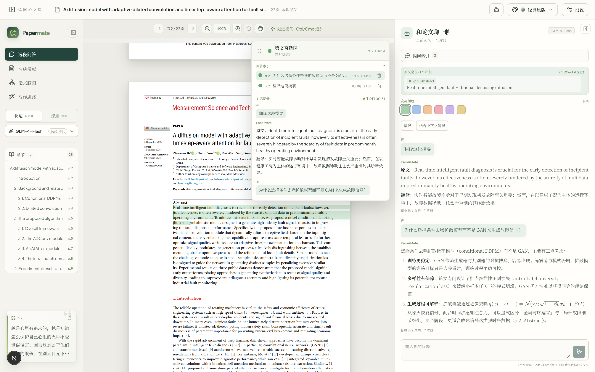

# PaperMate


PaperMate 是一个本地优先、AI 辅助的论文阅读工具。导入带文本层的 PDF 后，会按原版页面逐页展示，可以直接在透明文本层上划选段落进行多轮问答，也可以生成阅读笔记、论文脑图和写作思路分析。

English introduction: [README.md](README.md). Windows 一键安装详见 [安装说明.md](安装说明.md) 和 [INSTALL.md](INSTALL.md)。功能与版本历史详见 [功能日志.md](功能日志.md)。

## 功能

- **原版页面阅读**：使用 PDF.js 按论文原版排版渲染页面，透明文本层保证划选位置与原文一致。
- **段落划选提问**：划选一段原文即可提问，支持 `Ctrl`/`Cmd` 追加，一次最多组合 20 个片段。
- **多轮对话**：可以针对当前选区追问，也可以自由提问；提问时自动附带当前选区作为上下文。
- **两种模型模式**：`Flash` 适合翻译和普通问答；`MAX 思考` 适合解释、总结和写作分析。
- **结构化阅读成果**：生成 Markdown 阅读笔记、可折叠论文脑图和写作策略分析，支持数学公式渲染。
- **本地优先存储**：PDF、高亮、对话、笔记和生成内容保存在本机 SQLite 数据库 `data/papermate.db`；完整 JSON 备份由你手动生成。
- **Windows 一键安装/升级/卸载**：没有旧版本时选择位置全新安装；检测到旧版本时直接覆盖安装并保留 `data` 数据；另提供一键升级脚本，用当前源码直接更新已安装版本。

## 环境要求

- Node.js 22.5 或更高版本（建议 Node.js LTS）
- npm
- DeepSeek API Key 或智谱 GLM API Key（后者免费），用于模型请求，任选其一
- 一键安装脚本需要 Windows 10/11；手动开发可在任意支持 Node.js 与 Next.js 的系统上运行

## 快速开始

```bash
npm install
npm run dev
```

打开 `http://localhost:3000`，点击“模型设置”，输入 DeepSeek 或智谱 GLM 的 API Key 并验证连接。

## Windows 一键安装

- **全新安装（无旧版本）**：双击 `一键安装.bat`，选择安装位置，安装器自动复制项目、安装依赖、构建正式版本并创建快捷方式。
- **覆盖安装（有旧版本）**：再次双击 `一键安装.bat`，检测到 `%LOCALAPPDATA%\PaperMate\config.json` 中的已安装版本后，直接覆盖安装新版并保留 `data` 数据文件夹，无需重新选择安装位置。
- **一键升级**：项目根目录提供 `一键升级.bat`，直接用当前项目源码升级已安装版本，同样保留数据、不需要重新选择安装位置。
- 卸载可以从开始菜单、安装目录或 Windows 设置进入。详细步骤见 [安装说明.md](安装说明.md) 和 [INSTALL.md](INSTALL.md)。

## 使用方式

1. 把带文本层的 PDF 拖入应用，或点击选择文件。
2. 在原版页面上划选一段原文。
3. 使用 `Ctrl`/`Cmd` 追加更多片段。
4. 自由提问、翻译选区，或生成阅读笔记、论文脑图和写作思路。
5. 普通任务用“快速 Flash”，需要深入理解时切换到“深度 MAX 思考”。

## 界面一览

| 界面 | 说明 |
| --- | --- |
|  | 论文库：拖入 PDF、搜索论文、查看本机磁盘备份状态。 |
|  | 原版页面阅读器，透明文本层支持精确划选段落。 |
|  | 当前选区与多轮问答，支持翻译、结合上下文解释、详细讲解等快捷指令。 |
|  | 模型设置、提供方与 API Key 验证、界面主题与本机备份管理。 |
|  | 生成阅读笔记，关键结论标注原文页码与证据。 |
|  | 生成可折叠的论文论证结构脑图。 |
|  | 生成写作策略分析，包含可迁移的段落与句式框架。 |

## 结果文件保存

- 阅读笔记和写作思路是可编辑的 Markdown 文本。点击“保存本地”会下载以论文标题和成果类型命名的 `.md` 文件，例如 `1706.03762v7-阅读笔记.md`。
- 论文脑图会按相同命名规则下载为 `.svg` 图片。
- 每次生成的内容还会保存到本机 SQLite 数据库；只要项目目录还在，清空浏览器缓存后也能恢复。
- 设置面板提供整库 JSON 备份功能：立即备份、从磁盘恢复、导出 JSON 备份文件，以及在其他电脑上导入备份。
- `截图/` 目录中包含生成结果样例：[阅读笔记](截图/1706.03762v7-阅读笔记.md) 和 [写作思路](截图/1706.03762v7-写作思路.md)。

## 数据与隐私

- PDF、文本块、划选记录、对话与生成内容保存到本机 SQLite 数据库 `data/papermate.db`。只有执行“立即备份”或导出时才会生成 `data/papermate-backup.json` 完整 JSON。
- API Key 只保存在当前页面内存，不会写入 SQLite、备份文件、导出文件或服务器日志。
- 原始 PDF 不会上传；发给模型提供方的是当前任务所需的最小文本片段。
- 首版只支持可检索 PDF，不包含 OCR、DOCX、账号与云端同步。

## 项目结构

```text
app/          Next.js App Router 页面和 API 路由
components/   PDF 阅读器与界面组件
lib/          PDF 解析、存储、备份、脑图和测试
scripts/      Windows 安装、升级、启动、停止、卸载脚本
```

## 常用命令

```bash
npm run dev    # 启动开发服务器
npm run lint   # 运行 ESLint
npm run test   # 运行 Vitest 测试
npm run build  # 生成生产构建
npm start      # 运行生产构建
```

## 技术栈

Next.js 15、React 19、TypeScript、PDF.js、Node.js SQLite（`node:sqlite`）、IndexedDB（`idb`，仅供旧数据一次性迁移）、DeepSeek 与智谱 GLM 流式接口、`react-markdown`、KaTeX、ESLint、Vitest。

## 参与贡献

提交 Issue 或 Pull Request 前请阅读 [CONTRIBUTING.md](CONTRIBUTING.md)，并遵守 [CODE_OF_CONDUCT.md](CODE_OF_CONDUCT.md)。安全问题请通过 [SECURITY.md](SECURITY.md) 中的方式报告。

## 开源协议

本项目使用 [MIT License](LICENSE) 开源。
